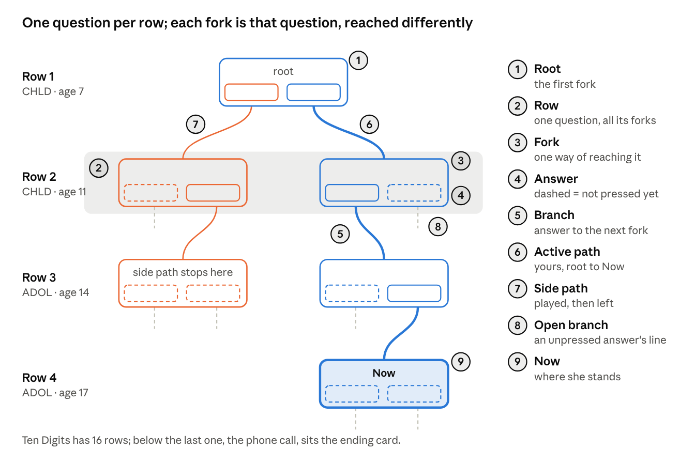
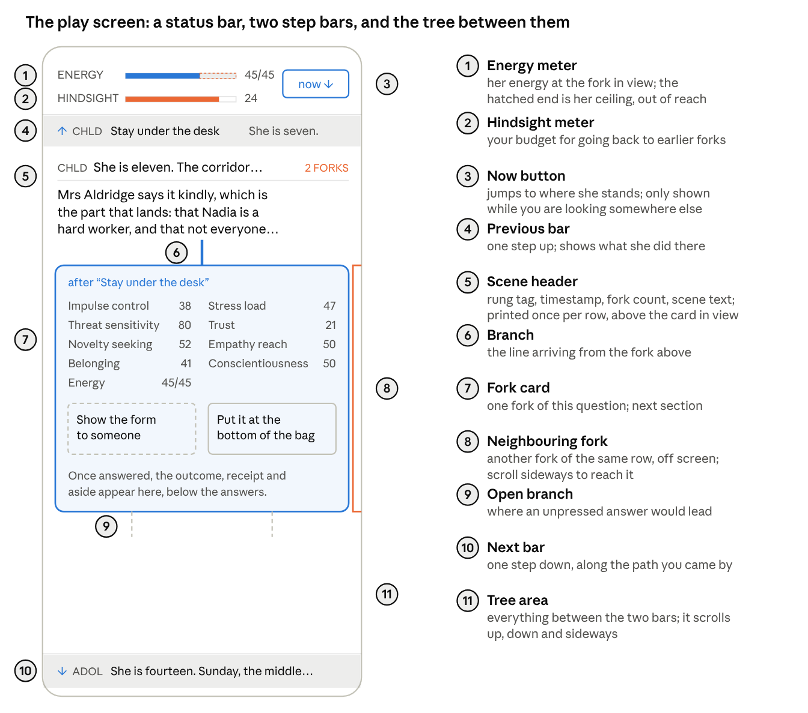
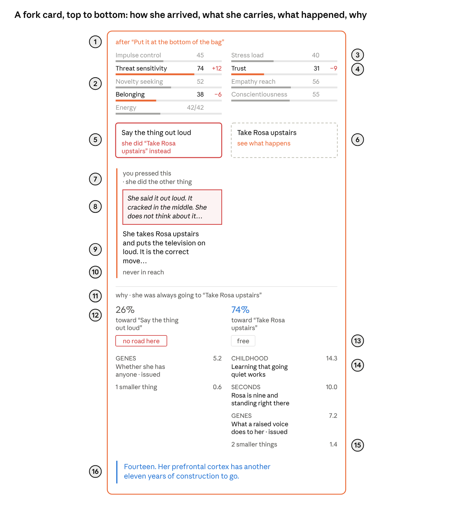
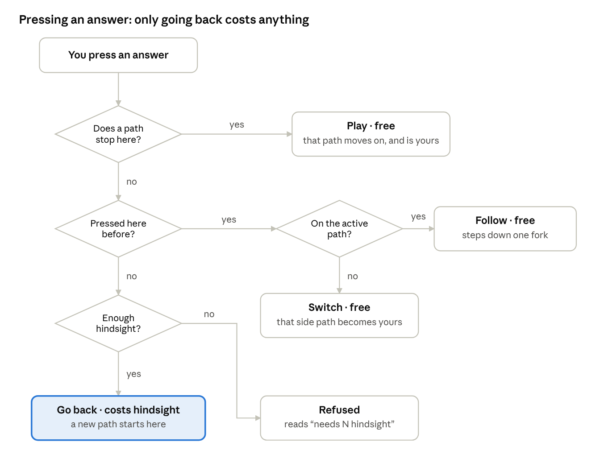

# Meritocracy — a shared vocabulary for the game screen

> The editable source of this page is the Claude Doc [Meritocracy — a shared vocabulary](https://claude.ai/code/artifact/4699f488-cc66-4f1b-af8b-7aea07cce546). This copy was exported on 2 Oct 2026; the diagrams are screenshots of its drawings.

## How to use this doc

Every visible thing in the game gets exactly one name here, so a piece of feedback can point at one element: *"the **delta** in the **carry panel** is too small to read"*. Names are **bold** where they are defined.

- The pictures are drawn mock-ups of the live screen. Numbered markers point at its parts, and a key beside or under each picture names them.
- The diagrams show things a single screenshot cannot: the shape of the whole tree, and what happens when you press.

Everything here describes the build currently live (`a322144`).

## The big picture: the tree

The game is one **tree** per **life**: each **row** is one question, and each **fork** in a row is that same question reached by a different sequence of earlier answers.

A row grows only as far as you explore it: row 2 has two forks because both answers at the root have been pressed. Exactly one **path** is the **active path**; every other path you have played is a **side path**, and it keeps showing what happened on it. (The diagrams use the doc's own colours; in the game the active path is gold and side paths are blue.) A new **life** means a new roll, and a new, empty tree.

The last row is the **anchor act**, the question the life exists for. Its forks wear a **double ring** and an "anchor act" label. Until you reach it, a dashed, double-ringed **anchor ghost** stands below the explored tree, showing the act and how many questions on it is, so you always see where the life is heading. It never says how hard the act will be.

What you press and what it does to her are kept apart. When the answer you pressed was never in reach, she does the other one and arrives exactly as if you had pressed that. The two answers' branches then meet at one fork, a **joined branch**, and the pressed answer's outcome ends with a **join line**: "nothing in her changed · this branch joins …". Whether branches join is only worked out once both are pressed, so the tree never gives away a fork's difficulty early.

## The play screen

The screen is a scrolling window onto the tree, with a **status bar** at the top and two pinned **step bars**: the **previous bar** above the tree and the **next bar** below it.

The **scene header** belongs to the row, not to a card: it is printed once and slides sideways to sit above whichever fork you are looking at. The **status bar** is the strip holding parts 1 and 2.

## Anatomy of a fork card

A **fork card** reads top to bottom: how she got here, what she carries in, the two **answers**, what happened, and why. Everything below the answers appears only once at least one answer has been pressed.

| # | Name | What it is |
| --- | --- | --- |
| 1 | **Arrival line** | What she did at the fork above to land here; adds "you pressed …" when that differs |
| 2 | **Carry panel** | The eight traits and energy she brings to this fork, one **measure** each |
| 3 | **Quiet measure** | Faded: the same in every fork of this row |
| 4 | **Lit measure** and **delta** | Bright: differs between forks of this row; the delta is its gap to the active fork |
| 5 | **Played answer** and **result line** | An answer somebody pressed here, with what she did; red when confabulated |
| 6 | **Unplayed answer** and **go-back line** | Dashed: nobody pressed it; behind Now the go-back line reads "see what happens" |
| 7 | **Outcome** | Directly under its own answer, so two outcomes sit side by side: "you pressed this", then what happened |
| 8 | **Confabulation** | Her own account of doing what you did not press |
| 9 | **Narration** | What actually happened |
| 10 | **Spend line** | What it cost her: flowed, overrode, emptied out, or never in reach |
| 11 | **Verdict line** | Opens the **receipt**: "she was always going to" when the other answer was never in reach, "she leaned toward" when it was |
| 12 | **Pull share** | Each answer's share of the force of her history |
| 13 | **Cost chip** | What going that way costs: free, a cost, more than she had, or no road here |
| 14 | **Cause** | One fact from her past: **rung tag**, what it was, how hard it pulls; **issued** if she was born with it |
| 15 | **Fold line** | The causes too small to list, counted and summed |
| 16 | **Aside** | The narrator, to you |

This card is a **side** fork, which is why its measures carry deltas against the active fork. The numbers are illustrative.

## States and colours

Colour always means the same thing: **gold** is the path you are on, **blue** is a path you have left, **red** is something going wrong for her or against what you pressed.

| What you see | Name | What it means |
| --- | --- | --- |
| Gold branch, gold card border | **Active** | On the active path, from the root to Now |
| Blue branch, blue card border | **Side** | On a side path: played before, not the one you are on |
| Card with a faint glow | **Now** | The fork she is standing at, waiting for your answer |
| Dashed answer button | **Unplayed** | Nobody has pressed this answer at this fork yet |
| Solid answer button | **Played** | Somebody pressed it; its outcome is shown on the card |
| Short dashed line under a card | **Open branch** | Where an unplayed answer would lead |
| Red-bordered answer, red result line | **Confabulated** | You pressed it, and she did the other answer instead |
| Bright measure in the carry panel | **Lit** | It differs between the forks in this row |
| Faded measure in the carry panel | **Quiet** | It is the same in every fork of this row |
| Green or red number beside a measure | **Delta** | Its difference from the active fork; green is better for her, red worse |
| Hatched right end of the energy bar | **Ceiling** | Energy she cannot reach here, because of sleep debt and stress |
| Text in a red frame, in italics | **Confabulation** | Her own explanation for doing what you did not press |
| Gold text with a gold rule on its left | **Aside** | The narrator talking to you |
| Two branches meeting at one fork | **Joined** | The press could not change her: she did the other answer and ended up in the same place |
| Double ring and an "anchor act" label | **Anchor act** | The question the life exists for; dashed while it is still a ghost below the tree |

## Moving around

There is one action that changes anything, **pressing** an answer, and it has four results. None of them costs anything, **going back** included.

Going back is free from any distance, as often as you like: the point is to compare paths, not to ration them. Everything else only moves your view:

| Move | How | What it does |
| --- | --- | --- |
| **Focus** | Tap a fork card | Looks at that fork; the scene header slides over to it |
| **Step up** | The previous bar | Looks at the fork one row above |
| **Step down** | The next bar | Looks at the fork one row below, along the path you came by |
| **Jump to now** | The Now button | Looks at the fork she is standing at |
| **Scroll** | Drag the tree | Looks anywhere, including neighbouring forks to the side |

## Before the life starts

Two screens come before the tree: the **title screen**, then the **roll**, which decides who she is born as. The roll is the only random thing in the game.

**Title screen**

| Name | What it is |
| --- | --- |
| **Game title** | "Meritocracy" |
| **Life label** | "Life one · Ten Digits" — which authored life you are about to play |
| **Anchor line** | "Nadia calls her father, or she does not." — the one act the life exists to explain |
| **Roll for a life** | The button that starts a new life |
| **Build stamp** | "build a322144" — which version of the game is on screen |
| **Life number** | The number that fixes this life's roll; the same number gives the same birth |

**Roll screen**

The roll reveals four **origins**, one per press of **Roll**. You cannot re-roll.

| Name | Example | What it is |
| --- | --- | --- |
| **Origin** | Ancestry · The house she was put in · Postcode · Body | One of the four things decided before she is born |
| **Origin prompt** | "You did not pick this. Nobody has ever picked this." | The grey line introducing the origin |
| **Origin result** | "Three generations of not enough" | What the dice gave her |
| **Trait chips** | Stress load +16 · Trust −4 | What that result does to her traits; green helps her, red hurts |
| **Quip** | "Oops! I guess you were born in the wrong family!" | The narrator's gold one-liner on the result |
| **Start her life** | — | The button that opens the tree at the root |

## The numbers underneath

Every fork is decided by arithmetic on her history, and all of it is shown on the card once the fork has been answered. There is no chance: the same history and the same press always give the same result.

**What she carries**

| Name | What it is | Higher is |
| --- | --- | --- |
| **Trait** | One of eight 0–100 numbers describing her, set by the roll and moved by every answer | — |
| Impulse control | How much deliberate control is online right now | better |
| Stress load | Everything the body is already carrying | worse |
| Threat sensitivity | How fast a room turns into a danger | worse |
| Trust | The default assumption that reaching out will not cost her | better |
| Novelty seeking | How much the unfamiliar pulls at her | neither |
| Empathy reach | How far out the circle of people who count extends | better |
| Belonging | Whether anyone's opinion of her survives the night | better |
| Conscientiousness | The habit of finishing things | better |
| **Energy** | What she can spend at this fork to go against her tendency | better |
| **Ceiling** | The most energy she can have here; sleep debt and stress push it down | better |

**How a fork is decided**

| Name | What it is |
| --- | --- |
| **Pull** | How hard her history pushes toward one answer |
| **Pull share** | One answer's pull as a percentage of the fork's total (17% vs 83%) |
| **Tendency** | The answer with the bigger pull: what she does if nothing intervenes. Always free |
| **Resistance** | How hard history pushes against the other answer |
| **Cost** | Energy needed to go against the tendency: resistance × 2.2 |
| **Affordable** | Cost is within the energy she has now: she does it, and pays |
| **Emptied out** | Cost is more than she has now but within her ceiling: she tries, empties out, and does the tendency |
| **Never in reach** | Cost is above her ceiling: "no road here" |
| **Cause** | One line of the receipt: a single fact about her past and how hard it pulls |
| **Issued** | Marks the part of a trait she was born with, which no going back can reach |
| **Confabulation** | She did the answer you did not press, and explains it to herself as her own choice |
| **Nudge** | The tendency answer at Now is drawn 1.5% larger and one step warmer; nothing else marks it |

**The causal ladder.** Every cause carries a **rung tag** saying how long before the moment it happened, always spelled out in full. From deepest to most recent: Evolution · Culture · Ancestry · Genes · Prenatal · Infancy · Childhood · Adolescence · Years · Months · Weeks · Days · Hours · Minutes · Seconds. The same tags label the questions, from Childhood at the root to Seconds at the phone call.

## Quick reference

Every name in this doc, alphabetically, with where it is explained.

| Term | In one line | Where |
| --- | --- | --- |
| Active / active path | The one path that is yours now, root to Now, drawn gold | Tree |
| Affordable | She can pay the cost, so she does it | Numbers |
| Anchor act | The last question, the one the life exists for; double-ringed in the tree from the start | Tree |
| Answer, answer button | One of a fork's two options, and the button for it | Fork card |
| Arrival line | "after 'X'" at the top of a fork card: how she got here | Fork card |
| Aside | The narrator's gold comment to you after a fork | Fork card |
| Branch | The line from an answer down to the fork it leads to | Tree |
| Carry panel | The eight traits and energy she brings to a fork | Fork card |
| Cause | One line of a receipt: a fact from her past and its pull | Fork card |
| Causal ladder, rung tag | How long ago something happened: Evolution … Seconds, always in full | Numbers |
| Ceiling | The hatched end of the energy bar: energy out of reach | Numbers |
| Confabulated, confabulation | She did the other answer; her excuse for it | Fork card |
| Cost, cost chip | Energy needed to go against the tendency | Fork card |
| Delta | A lit measure's difference from the active fork | Fork card |
| Emptied out | Cost above her energy but within her ceiling | Numbers |
| Ending card | Below the last question: what became of her | Tree |
| Energy meter | The bar in the status bar; its hatched end is the ceiling. Once the fork in view is answered it shows what is left, with the spend beside the number ("1/40 −39") | Screen |
| Focus | Tapping a card to look at it, without changing anything | Moving |
| Fold line | "3 smaller things": the tiny causes, summed | Fork card |
| Follow | Pressing a played answer on the active path: steps down | Moving |
| Fork, fork card | One version of a question, reached by one history | Tree |
| Fork count | "2 forks" in the scene header | Screen |
| Go back, go-back line | Pressing an unplayed answer behind Now; free, and a new path starts there | Moving |
| Issued | The part of a trait she was born with | Numbers |
| Joined branch, join line | Two answers that lead to one fork because the press changed nothing; the line saying so under the outcome | Tree |
| Life | Everything from one roll; another life means a new roll | Tree |
| Life (scenario) | The authored scenario, "Ten Digits"; in code, a single roll of it is a run, a word never shown on screen | Before |
| Lit, quiet | A measure that differs between forks, or is the same | Fork card |
| Narration | What actually happened, in a played answer's outcome | Fork card |
| Never in reach | Cost above her ceiling: "no road here" | Numbers |
| Next bar, previous bar | The pinned bars at the bottom and top: one step down or up | Screen |
| Now, Now button | The fork she stands at; the button that jumps there | Tree |
| Nudge | The tendency answer drawn 1.5% larger at Now | Numbers |
| Open branch | The short dashed line under an unplayed answer | Tree |
| Origin, origin result, quip, trait chips | The four parts of the roll and how each is shown | Before |
| Outcome | What happened for one played answer | Fork card |
| Path | A chain of answers from the root to a fork | Tree |
| Play | Pressing an answer at Now; free | Moving |
| Played, unplayed | An answer somebody has pressed here, or not | States |
| Pull, pull share | How hard history pushes toward an answer; as a % | Numbers |
| Question | What a row asks; a row holds every fork of one question | Screen |
| Receipt, receipt column | Why she leaned the way she did, split by answer | Fork card |
| Result line | What a played answer did, under its label | Fork card |
| Root | The first fork, at the top of the tree | Tree |
| Row | Every fork of one question, side by side | Tree |
| Same-carry note | "she carries exactly the same…" when nothing is lit | Fork card |
| Scene header, scene text | Header above the cards, once per row: scene text, timestamp, fork count; the scene text is the question's prose | Screen |
| Side path | A path you played and left, drawn blue | Tree |
| Spend line | The result: flowed, overrode, emptied out or never in reach ("free · the way she was going", "cost 41 of 45") | Fork card |
| Status bar | The top strip: the energy meter and the Now button | Screen |
| Step up, step down | Using the previous or next bar | Moving |
| Switch | Pressing a played answer on a side path; it becomes active | Moving |
| Tendency | The answer her history leans toward; always free | Numbers |
| Timestamp | "She is seven. The hallway." in the scene header | Screen |
| Trait | One of eight 0–100 numbers describing her | Numbers |
| Tree | The whole map of one life's forks, top to bottom | Tree |
| Verdict line | "why · she was always going to …" or "why · she leaned toward …" over the receipt | Fork card |
